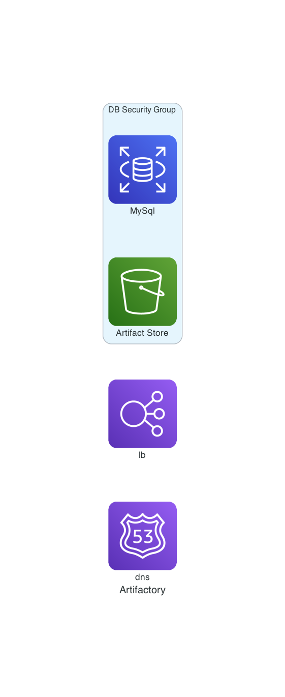

# terraform-aws-artifactory

[](https://github.com/JamesWoolfenden/terraform-aws-artifactory)
[](https://github.com/JamesWoolfenden/terraform-aws-artifactory/releases/latest)
[](https://github.com/JamesWoolfenden/terraform-aws-artifactory/releases/latest)

[](https://www.bridgecrew.cloud/link/badge?vcs=github&fullRepo=JamesWoolfenden%2Fterraform-aws-artifactory&benchmark=CIS+AWS+V1.2)
[](https://github.com/pre-commit/pre-commit)
[](https://www.checkov.io/)
[](https://www.bridgecrew.cloud/link/badge?vcs=github&fullRepo=JamesWoolfenden%2Fterraform-aws-artifactory&benchmark=INFRASTRUCTURE+SECURITY)

Updated and significantly modified from <https://github.com/jfrog/JFrog-Cloud-Installers>

This method has a number of Issues including:

- SSL termination, requires upfront provision of non ACM certificate rather than termination of SSL at an ELB.
- Creates an IAM user.
- Generates access keys for IAM user and adds it to filesystem of an instance.
- Security groups very very open

## Terraform Template For Artifactory Enterprise

## Prerequisites

- An AWS account
- Basic knowledge of AWS
- Predefined Keys
- Basic knowledge of Artifactory
- Learn about [system requirements for Artifactory](https://www.jfrog.com/confluence/display/RTF/System+Requirements#SystemRequirements-RecommendedHardware)
- Learn more about Terraform AWS provider follow: https://www.terraform.io/docs/providers/aws/index.html

## Usage

There are 2 examples included one, provisions into an existing VPC the other create a vpc for you as well.

example
├── examplea
└── exampleb-newvpc

Copy either as you starting point or make your own by adding a module definition to your own code module.artifactory.tf:



```terraform
module "artifactory" {
  source             = "JamesWoolfenden/artifactory-oss/aws"
  version            = "0.1.0"
  subnet_ids         = var.subnet_ids
  vpc_id             = var.vpc_id
  ssl_certificate_id = var.ssl_certificate_id
  vpc_cidr           = var.vpc_cidr
  ssh_access         = [module.ip.cidr]
  access_cidr        = [module.ip.cidr]
  bucket_name        = "artifactory-${data.aws_caller_identity.current.account_id}"
  instance_type      = "m4.xlarge"
  record             = var.record
  zone_id            = var.zone_id
}

```

## Costs

```text
Monthly cost estimate

Project: JamesWoolfenden/terraform-aws-artifactory/example/examplea

 Name                                                           Monthly Qty  Unit                    Monthly Cost

 module.artifactory.aws_autoscaling_group.art
 └─ module.artifactory.aws_launch_configuration.master
    ├─ Instance usage (Linux/UNIX, on-demand, m4.xlarge)                730  hours                        $169.36
    ├─ EC2 detailed monitoring                                            7  metrics                        $2.10
    └─ root_block_device
       └─ Storage (general purpose SSD, gp2)                            250  GB                            $29.00

 module.artifactory.aws_db_instance.default
 ├─ Database instance                                                   730  hours                         $27.74
 └─ Database storage                                                      5  GB                             $0.67

 module.artifactory.aws_elb.web
 ├─ Classic load balancer                                               730  hours                         $21.46
 └─ Data processed                                        Monthly cost depends on usage: $0.0084 per GB

 module.artifactory.aws_s3_bucket.b
 └─ Standard
    ├─ Storage                                            Monthly cost depends on usage: $0.024 per GB
    ├─ PUT, COPY, POST, LIST requests                     Monthly cost depends on usage: $0.0053 per 1k requests
    ├─ GET, SELECT, and all other requests                Monthly cost depends on usage: $0.00042 per 1k requests
    ├─ Select data scanned                                Monthly cost depends on usage: $0.00225 per GB
    └─ Select data returned                               Monthly cost depends on usage: $0.0008 per GB

 OVERALL TOTAL                                                                                            $250.33
```

### Steps to Deploy Artifactory Enterprise Using Terraform Template

1. Set your AWS account credentials by setting environment variables:

   ```bash
       export AWS_ACCESS_KEY_ID="your_access_key"
       export AWS_SECRET_ACCESS_KEY="your_secret_key"
       export AWS_DEFAULT_REGION="aws_region"
   ```

   To learn more about Terraform aws provider follow there documentation.
   https://www.terraform.io/docs/providers/aws/index.html

2. Modify the default values in the `variables.tf` file

3. Pass the Artifactory Enterprise licenses as a string in the variables `artifactory_license_1-5`.
   For example: Change disk space to 500Gb:

   ```bash
    variable "volume_size" {
      description = "Disk size for each EC2 instances"
      default     = 500
    }
   ```

4. Run the `terraform init -var 'key_name=myAwsKey'` command. This will install the required plugin for the AWS provider.

5. Run the `terraform plan -var 'key_name=myAwsKey'` command.

6. Run the `terraform apply -var 'key_name=myAwsKey'` command to deploy Artifactory Enterprise cluster on AWS

   **Note**: it takes approximately 15 minutes to bring up the cluster.

7. You will receive ELB Url to access Artifactory. By default, this template starts only one node in the Artifactory cluster.
   It takes 7-10 minutes for Artifactory to start and to attach the instance to the ELB.The output can be viewed as:

   ```terraform
    Outputs:

    address = artifactory-elb-265664219.us-west-2.elb.amazonaws.com
   ```

8. Access the Artifactory UI using ELB Url provided in outputs.

9. Scale your cluster using following command: `terraform apply -var 'key_name=myAwsKey' -var 'secondary_node_count=2'`
   In this example we are scaling artifactory cluster to 2 nodes.

   **Note**: You can only scale nodes to number of artifactory licenses you have available for cluster.

10. SSH into Artifactory primary instance and type [inactiveServerCleaner](inactiveServerCleaner.groovy) plugin in `'/var/opt/jfrog/artifactory/etc/plugins'` directory.
    (Optional) To destroy the cluster, run the following commend: `terraform destroy -var 'key_name=myAwsKey'`

### Note

This template only supports Artifactory version 5.8.x and above.
Turn off daily backups. Read Documentation provided [here](https://www.jfrog.com/confluence/display/RTF/Managing+Backups).

**Note**: In this template as default S3 is default filestore and data is persisted in S3. If you keep daily backups on disk space (default 250Gb) will get occupied quickly.
Use an SSL Certificate with a valid wildcard to your artifactory as docker registry with subdomain method.

### Use Artifactory as backend

To to store state as an artifact in a given repository of Artifactory, see [https://www.terraform.io/docs/backends/types/artifactory.html](https://www.terraform.io/docs/backends/types/artifactory.html)

<!-- BEGINNING OF PRE-COMMIT-TERRAFORM DOCS HOOK -->
## Requirements

No requirements.

## Providers

| Name | Version |
|------|---------|
| <a name="provider_aws"></a> [aws](#provider\_aws) | n/a |
| <a name="provider_local"></a> [local](#provider\_local) | n/a |
| <a name="provider_template"></a> [template](#provider\_template) | n/a |
| <a name="provider_tls"></a> [tls](#provider\_tls) | n/a |

## Modules

No modules.

## Resources

| Name | Type |
|------|------|
| [aws_autoscaling_attachment.asg_attachment_bar](https://registry.terraform.io/providers/hashicorp/aws/latest/docs/resources/autoscaling_attachment) | resource |
| [aws_autoscaling_group.art](https://registry.terraform.io/providers/hashicorp/aws/latest/docs/resources/autoscaling_group) | resource |
| [aws_db_instance.default](https://registry.terraform.io/providers/hashicorp/aws/latest/docs/resources/db_instance) | resource |
| [aws_db_subnet_group.main_db_subnet_group](https://registry.terraform.io/providers/hashicorp/aws/latest/docs/resources/db_subnet_group) | resource |
| [aws_elb.web](https://registry.terraform.io/providers/hashicorp/aws/latest/docs/resources/elb) | resource |
| [aws_iam_instance_profile.art](https://registry.terraform.io/providers/hashicorp/aws/latest/docs/resources/iam_instance_profile) | resource |
| [aws_iam_role.art](https://registry.terraform.io/providers/hashicorp/aws/latest/docs/resources/iam_role) | resource |
| [aws_iam_role_policy.art](https://registry.terraform.io/providers/hashicorp/aws/latest/docs/resources/iam_role_policy) | resource |
| [aws_key_pair.ssm_key](https://registry.terraform.io/providers/hashicorp/aws/latest/docs/resources/key_pair) | resource |
| [aws_launch_configuration.master](https://registry.terraform.io/providers/hashicorp/aws/latest/docs/resources/launch_configuration) | resource |
| [aws_route53_record.www](https://registry.terraform.io/providers/hashicorp/aws/latest/docs/resources/route53_record) | resource |
| [aws_s3_bucket.b](https://registry.terraform.io/providers/hashicorp/aws/latest/docs/resources/s3_bucket) | resource |
| [aws_s3_bucket_acl.b](https://registry.terraform.io/providers/hashicorp/aws/latest/docs/resources/s3_bucket_acl) | resource |
| [aws_s3_bucket_public_access_block.b](https://registry.terraform.io/providers/hashicorp/aws/latest/docs/resources/s3_bucket_public_access_block) | resource |
| [aws_s3_bucket_server_side_encryption_configuration.b](https://registry.terraform.io/providers/hashicorp/aws/latest/docs/resources/s3_bucket_server_side_encryption_configuration) | resource |
| [aws_s3_bucket_versioning.b](https://registry.terraform.io/providers/hashicorp/aws/latest/docs/resources/s3_bucket_versioning) | resource |
| [aws_security_group.default](https://registry.terraform.io/providers/hashicorp/aws/latest/docs/resources/security_group) | resource |
| [aws_security_group.elb](https://registry.terraform.io/providers/hashicorp/aws/latest/docs/resources/security_group) | resource |
| [aws_security_group.main_db_access](https://registry.terraform.io/providers/hashicorp/aws/latest/docs/resources/security_group) | resource |
| [aws_security_group_rule.allow_all_outbound](https://registry.terraform.io/providers/hashicorp/aws/latest/docs/resources/security_group_rule) | resource |
| [aws_security_group_rule.allow_db_access](https://registry.terraform.io/providers/hashicorp/aws/latest/docs/resources/security_group_rule) | resource |
| [local_file.private_ssh](https://registry.terraform.io/providers/hashicorp/local/latest/docs/resources/file) | resource |
| [local_file.public_ssh](https://registry.terraform.io/providers/hashicorp/local/latest/docs/resources/file) | resource |
| [tls_private_key.ssh](https://registry.terraform.io/providers/hashicorp/tls/latest/docs/resources/private_key) | resource |
| [aws_ami.amazon_linux_2_ami](https://registry.terraform.io/providers/hashicorp/aws/latest/docs/data-sources/ami) | data source |
| [template_file.init](https://registry.terraform.io/providers/hashicorp/template/latest/docs/data-sources/file) | data source |

## Inputs

| Name | Description | Type | Default | Required |
|------|-------------|------|---------|:--------:|
| <a name="input_access_cidr"></a> [access\_cidr](#input\_access\_cidr) | n/a | `list(any)` | n/a | yes |
| <a name="input_artifactory_server_name"></a> [artifactory\_server\_name](#input\_artifactory\_server\_name) | Provide artifactory server name to be used in Nginx. e.g artifactory for artifactory.jfrog.team | `string` | `"artifactory"` | no |
| <a name="input_artifactory_sg_name"></a> [artifactory\_sg\_name](#input\_artifactory\_sg\_name) | (optional) describe your variable | `string` | `"artifactory_sg"` | no |
| <a name="input_autoscaling_group_name"></a> [autoscaling\_group\_name](#input\_autoscaling\_group\_name) | artifactory autoscaling group | `string` | `"artifactory autoscaling group"` | no |
| <a name="input_bucket_name"></a> [bucket\_name](#input\_bucket\_name) | AWS S3 Bucket name | `string` | n/a | yes |
| <a name="input_db_allocated_storage"></a> [db\_allocated\_storage](#input\_db\_allocated\_storage) | The size of the database (Gb) | `string` | `"5"` | no |
| <a name="input_db_instance_class"></a> [db\_instance\_class](#input\_db\_instance\_class) | The database instance type | `string` | `"db.t2.small"` | no |
| <a name="input_db_name"></a> [db\_name](#input\_db\_name) | MySQL database name | `string` | `"artdb"` | no |
| <a name="input_db_password"></a> [db\_password](#input\_db\_password) | Database password | `string` | n/a | yes |
| <a name="input_db_user"></a> [db\_user](#input\_db\_user) | Database user name | `string` | `"artifactory"` | no |
| <a name="input_elb_name"></a> [elb\_name](#input\_elb\_name) | The name of the Load balancer | `string` | `"artifactoryelb"` | no |
| <a name="input_extra_java_options"></a> [extra\_java\_options](#input\_extra\_java\_options) | Setting Java Memory Parameters for Artifactory. Learn about system requirements for Artifactory https://www.jfrog.com/confluence/display/RTF/System+Requirements#SystemRequirements-RecommendedHardware. | `string` | `"-server -Xms2g -Xmx14g -Xss256k -XX:+UseG1GC -XX:OnOutOfMemoryError=\\\\"kill -9 %p\\\\""` | no |
| <a name="input_instance_type"></a> [instance\_type](#input\_instance\_type) | Artifactory EC2 instance type | `string` | n/a | yes |
| <a name="input_key_name"></a> [key\_name](#input\_key\_name) | Desired name of AWS key pair | `string` | `"jfrog"` | no |
| <a name="input_kms_key"></a> [kms\_key](#input\_kms\_key) | n/a | `any` | n/a | yes |
| <a name="input_master_key"></a> [master\_key](#input\_master\_key) | Master key for Artifactory cluster. Generate master.key using command '$openssl rand -hex 16' | `string` | `"35767fa0164bac66b6cccb8880babefb"` | no |
| <a name="input_monitoring_interval"></a> [monitoring\_interval](#input\_monitoring\_interval) | The interval, in seconds, between points when Enhanced Monitoring metrics are collected for the DB instance | `string` | `30` | no |
| <a name="input_monitoring_role_arn"></a> [monitoring\_role\_arn](#input\_monitoring\_role\_arn) | n/a | `string` | `""` | no |
| <a name="input_profile_name"></a> [profile\_name](#input\_profile\_name) | Instance profile name | `string` | `"artifactory"` | no |
| <a name="input_rds"></a> [rds](#input\_rds) | Settings for the DB instance | `map(any)` | <pre>{<br>  "engine": "mysql",<br>  "engine_version": "5.5",<br>  "multi_az": "false",<br>  "skip_final_snapshot": "true",<br>  "storage_type": "gp2"<br>}</pre> | no |
| <a name="input_record"></a> [record](#input\_record) | Value for Route53 entry | `string` | n/a | yes |
| <a name="input_sse_algorithm"></a> [sse\_algorithm](#input\_sse\_algorithm) | The type of encryption algorithm to use | `string` | `"aws:kms"` | no |
| <a name="input_ssh_access"></a> [ssh\_access](#input\_ssh\_access) | n/a | `list(any)` | n/a | yes |
| <a name="input_ssl_certificate_id"></a> [ssl\_certificate\_id](#input\_ssl\_certificate\_id) | The ID of the SSL certificate from ACM | `string` | n/a | yes |
| <a name="input_subnet_ids"></a> [subnet\_ids](#input\_subnet\_ids) | A list of Subnet ids | `list(any)` | n/a | yes |
| <a name="input_volume_size"></a> [volume\_size](#input\_volume\_size) | Disk size for each EC2 instances | `string` | `250` | no |
| <a name="input_vpc_cidr"></a> [vpc\_cidr](#input\_vpc\_cidr) | The CIDR of the VPC | `list(any)` | n/a | yes |
| <a name="input_vpc_id"></a> [vpc\_id](#input\_vpc\_id) | The VPC id | `string` | n/a | yes |
| <a name="input_zone_id"></a> [zone\_id](#input\_zone\_id) | The Route53 zone for the record | `string` | n/a | yes |

## Outputs

| Name | Description |
|------|-------------|
| <a name="output_address"></a> [address](#output\_address) | URL of the Artifactory |
<!-- END OF PRE-COMMIT-TERRAFORM DOCS HOOK -->

## Policy

<!-- BEGINNING OF PRE-COMMIT-PIKE DOCS HOOK -->
The Policy required is:

```json
{
    "Version": "2012-10-17",
    "Statement": [
        {
            "Sid": "VisualEditor0",
            "Effect": "Allow",
            "Action": [
                "autoscaling:AttachLoadBalancers",
                "autoscaling:CreateAutoScalingGroup",
                "autoscaling:CreateLaunchConfiguration",
                "autoscaling:DeleteAutoScalingGroup",
                "autoscaling:DeleteLaunchConfiguration",
                "autoscaling:DescribeAutoScalingGroups",
                "autoscaling:DescribeLaunchConfigurations",
                "autoscaling:DescribeScalingActivities",
                "autoscaling:DetachLoadBalancers",
                "autoscaling:UpdateAutoScalingGroup"
            ],
            "Resource": "*"
        },
        {
            "Sid": "VisualEditor1",
            "Effect": "Allow",
            "Action": [
                "ec2:AttachInternetGateway",
                "ec2:AuthorizeSecurityGroupEgress",
                "ec2:AuthorizeSecurityGroupIngress",
                "ec2:CreateInternetGateway",
                "ec2:CreateKeyPair",
                "ec2:CreateRoute",
                "ec2:CreateSecurityGroup",
                "ec2:CreateSubnet",
                "ec2:CreateVPC",
                "ec2:DeleteInternetGateway",
                "ec2:DeleteKeyPair",
                "ec2:DeleteRoute",
                "ec2:DeleteSecurityGroup",
                "ec2:DeleteSubnet",
                "ec2:DeleteVPC",
                "ec2:DescribeAccountAttributes",
                "ec2:DescribeAvailabilityZones",
                "ec2:DescribeImages",
                "ec2:DescribeInternetGateways",
                "ec2:DescribeKeyPairs",
                "ec2:DescribeNetworkInterfaces",
                "ec2:DescribeRouteTables",
                "ec2:DescribeSecurityGroups",
                "ec2:DescribeSubnets",
                "ec2:DescribeVpcAttribute",
                "ec2:DescribeVpcs",
                "ec2:DetachInternetGateway",
                "ec2:ImportKeyPair",
                "ec2:RevokeSecurityGroupEgress",
                "ec2:RevokeSecurityGroupIngress"
            ],
            "Resource": "*"
        },
        {
            "Sid": "VisualEditor2",
            "Effect": "Allow",
            "Action": [
                "elasticloadbalancing:AttachLoadBalancerToSubnets",
                "elasticloadbalancing:CreateLoadBalancer",
                "elasticloadbalancing:CreateLoadBalancerListeners",
                "elasticloadbalancing:DeleteLoadBalancer",
                "elasticloadbalancing:DescribeLoadBalancerAttributes",
                "elasticloadbalancing:DescribeLoadBalancers",
                "elasticloadbalancing:DescribeTags",
                "elasticloadbalancing:ModifyLoadBalancerAttributes"
            ],
            "Resource": "*"
        },
        {
            "Sid": "VisualEditor3",
            "Effect": "Allow",
            "Action": [
                "iam:AddRoleToInstanceProfile",
                "iam:CreateInstanceProfile",
                "iam:CreateRole",
                "iam:DeleteInstanceProfile",
                "iam:DeleteRole",
                "iam:DeleteRolePolicy",
                "iam:GetInstanceProfile",
                "iam:GetRole",
                "iam:GetRolePolicy",
                "iam:ListAttachedRolePolicies",
                "iam:ListInstanceProfilesForRole",
                "iam:ListRolePolicies",
                "iam:PassRole",
                "iam:PutRolePolicy",
                "iam:RemoveRoleFromInstanceProfile"
            ],
            "Resource": "*"
        },
        {
            "Sid": "VisualEditor4",
            "Effect": "Allow",
            "Action": [
                "kms:CreateKey",
                "kms:DescribeKey",
                "kms:EnableKeyRotation",
                "kms:GetKeyPolicy",
                "kms:GetKeyRotationStatus",
                "kms:ListResourceTags",
                "kms:ScheduleKeyDeletion"
            ],
            "Resource": "*"
        },
        {
            "Sid": "VisualEditor5",
            "Effect": "Allow",
            "Action": [
                "rds:CreateDBInstance",
                "rds:CreateDBSubnetGroup",
                "rds:DeleteDBSubnetGroup",
                "rds:DescribeDBInstances",
                "rds:DescribeDBSubnetGroups",
                "rds:ListTagsForResource",
                "rds:ModifyDBInstance"
            ],
            "Resource": "*"
        },
        {
            "Sid": "VisualEditor6",
            "Effect": "Allow",
            "Action": [
                "route53:ChangeResourceRecordSets",
                "route53:GetChange",
                "route53:GetHostedZone",
                "route53:ListResourceRecordSets"
            ],
            "Resource": "*"
        },
        {
            "Sid": "VisualEditor7",
            "Effect": "Allow",
            "Action": [
                "s3:CreateBucket",
                "s3:DeleteBucket",
                "s3:GetAccelerateConfiguration",
                "s3:GetBucketAcl",
                "s3:GetBucketCORS",
                "s3:GetBucketLogging",
                "s3:GetBucketObjectLockConfiguration",
                "s3:GetBucketPolicy",
                "s3:GetBucketPublicAccessBlock",
                "s3:GetBucketRequestPayment",
                "s3:GetBucketTagging",
                "s3:GetBucketVersioning",
                "s3:GetBucketWebsite",
                "s3:GetEncryptionConfiguration",
                "s3:GetLifecycleConfiguration",
                "s3:GetObject",
                "s3:GetObjectAcl",
                "s3:GetReplicationConfiguration",
                "s3:ListAllMyBuckets",
                "s3:ListBucket",
                "s3:PutBucketAcl",
                "s3:PutBucketPublicAccessBlock",
                "s3:PutBucketVersioning",
                "s3:PutEncryptionConfiguration"
            ],
            "Resource": "*"
        }
    ]
}

```
<!-- END OF PRE-COMMIT-PIKE DOCS HOOK -->

## Related Projects

Check out these related projects.

- [terraform-aws-s3](https://github.com/jameswoolfenden/terraform-aws-s3) - S3 buckets

## Help

**Got a question?**

File a GitHub [issue](https://github.com/JamesWoolfenden/terraform-aws-artifactory/issues).

## Contributing

### Bug Reports & Feature Requests

Please use the [issue tracker](https://github.com/JamesWoolfenden/terraform-aws-artifactory/issues) to report any bugs or file feature requests.

## Copyrights

Copyright © 2019-2022 James Woolfenden

## License

[](https://opensource.org/licenses/Apache-2.0)

See [LICENSE](LICENSE) for full details.

Licensed to the Apache Software Foundation (ASF) under one
or more contributor license agreements. See the NOTICE file
distributed with this work for additional information
regarding copyright ownership. The ASF licenses this file
to you under the Apache License, Version 2.0 (the
"License"); you may not use this file except in compliance
with the License. You may obtain a copy of the License at

<https://www.apache.org/licenses/LICENSE-2.0>

Unless required by applicable law or agreed to in writing,
software distributed under the License is distributed on an
"AS IS" BASIS, WITHOUT WARRANTIES OR CONDITIONS OF ANY
KIND, either express or implied. See the License for the
specific language governing permissions and limitations
under the License.

### Contributors

[![James Woolfenden][jameswoolfenden_avatar]][jameswoolfenden_homepage]<br/>[James Woolfenden][jameswoolfenden_homepage]

[jameswoolfenden_homepage]: https://github.com/jameswoolfenden
[jameswoolfenden_avatar]: https://github.com/jameswoolfenden.png?size=150
